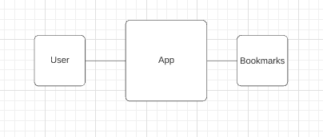

# Bookmark Manager

User Story:

```
As a user
I want to show a list of my bookmarks
```
Diagram:


```
As a time-pressed user
So that I can save a website
I would like to add the site's address and title to bookmark manager
```
- Now to address the user story above. At this time I have implemented a database and now can go about adding a new bookmark (first full stack feature)
  - For this I am going to have to incorportate a method in my Bookmark class that can access the database and create a new row in the bookmarks table.
  - I then need to link this to the app.rb, so that I can display it within my website (views).
- I have added a test database, described below in the databases explanation
  - this allows me to have a test database that I can add bookmarks to and clear each time I run an rspec. As a result I don't have to change my tests according to what is in the database but I can add them via connection to PostgreSQL


### Setting up the database (Documenting Database Setup):
- Setup psql
- Go into user
```
psql student
```
- Create the database
```
CREATE DATABASE bookmark_manager;
```
- Enter the database
```
\c bookmark_manager
```
- Then you must run the query from the file 01_create_bookmarks_table.sql


- Create a testing database using the same steps as above
